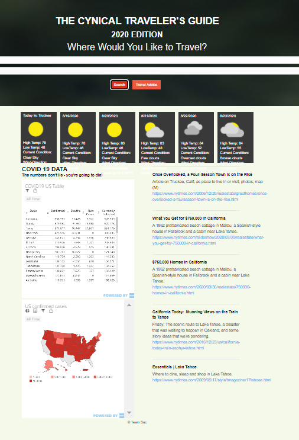

# The Cynical Travelers Guide To 2020

https://joeschlick.github.io/team-sac-repo/

## Description 
When traveling within the United States in 2020, I want to know what kind of terrible things are happening in my destination city. Then I can make an informed decisions regarding my personal safety, and decide if it’s safe to travel there at all!

We wanted to create a website to show how dangerous the world is in 2020 and how to navigate the risks as a traveler

Our site would consist of an input field for destination city and state. Once the info is entered the following information will be returned:
    A 5 day weather forecast in case a hurricane is on the way
    The latest COVID-19 data 
    Number of new cases for the day
    Direction the data is trending
    Number of deaths
    Breaking local news stories to inform me of any current or impending disasters.

## Usage

## Credits
Team SAC personnel:
    Christian Castillo
    Ian Astesana
    Joe Schlick

## License 

[MIT](https://choosealicense.com/licenses/mit/)

Copyright (c) [2020] [Team Sac]

Permission is hereby granted, free of charge, to any person obtaining a copy
of this software and associated documentation files (the "Software"), to deal
in the Software without restriction, including without limitation the rights
to use, copy, modify, merge, publish, distribute, sublicense, and/or sell
copies of the Software, and to permit persons to whom the Software is
furnished to do so, subject to the following conditions:

The above copyright notice and this permission notice shall be included in all
copies or substantial portions of the Software.

THE SOFTWARE IS PROVIDED "AS IS", WITHOUT WARRANTY OF ANY KIND, EXPRESS OR
IMPLIED, INCLUDING BUT NOT LIMITED TO THE WARRANTIES OF MERCHANTABILITY,
FITNESS FOR A PARTICULAR PURPOSE AND NONINFRINGEMENT. IN NO EVENT SHALL THE
AUTHORS OR COPYRIGHT HOLDERS BE LIABLE FOR ANY CLAIM, DAMAGES OR OTHER
LIABILITY, WHETHER IN AN ACTION OF CONTRACT, TORT OR OTHERWISE, ARISING FROM,
OUT OF OR IN CONNECTION WITH THE SOFTWARE OR THE USE OR OTHER DEALINGS IN THE
SOFTWARE.
